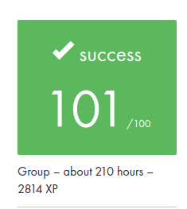

# **Minishell: An Unix Shell**

## **Overview**

**Minishell** is a simplified version of the Unix shell, implemented as part of my curriculum at School 42. It mimics the behavior of common Unix shells like **bash**. This project focuses on processes, file descriptors, and signal handling, offering a deep understanding of how a shell operates.

Through the development of **Minishell**, I have gained hands-on experience with managing system calls, handling input/output, and implementing built-in commands. This project also improves my understanding of how shells manage environment variables and process pipelines.

---

## **Key Features**

- **Prompt**: Displays a prompt when waiting for user input.
- **Command Execution**: Executes programs located in the system's `PATH` or using relative/absolute paths.
- **Pipes**: Supports piping (`|`) to connect the output of one command to the input of another.
- **Redirection**: Supports input (`<`), output (`>`), and append (`>>`) redirections.
- **Built-in Commands**: Includes several built-in commands like `echo`, `cd`, `pwd`, `export`, `unset`, `env`, and `exit`.
- **Signal Handling**: Properly handles signals such as `ctrl-C`, `ctrl-D`, and `ctrl-\` to behave like bash.
- **History**: Keeps a history of executed commands.

---

## **Built-in Commands**

- **echo**: Prints arguments to the terminal, with an option to omit the newline (`-n`).
- **cd**: Changes the current working directory.
- **pwd**: Prints the current working directory.
- **export**: Sets environment variables.
- **unset**: Unsets environment variables.
- **env**: Displays the current environment variables.
- **exit**: Exits the shell.

---

## **Project Challenges**

- **Signal Handling**: Implementing proper handling for `ctrl-C`, `ctrl-D`, and `ctrl-\` to behave exactly like bash required a deep understanding of signal management in Unix.
- **Memory Management**: Ensuring no memory leaks, while working with the `readline()` function, which is known to cause memory leaks, was an interesting challenge.
- **Process Management**: Managing multiple processes with pipes and redirections involved careful orchestration of file descriptors and process control.

## **Installation and Usage**

You will need clang and C library to compile the project !

1. Clone the repository and compile it.
```bash
git clone https://github.com/thibault-deverge/42-Cursus__Minishell minishell
cd minishell
make
```

2. Run the shell
```bash
./minishell
```

## Rating


